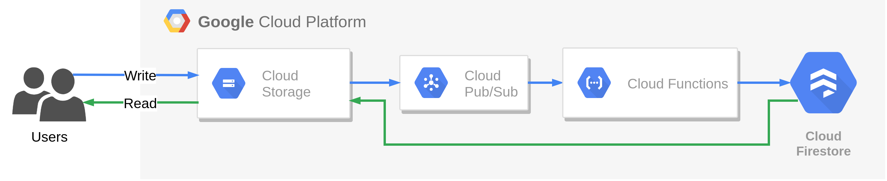

# The result of migrating the application to the Google Cloud using the `rip and replace` strategy.


# Fill configuration:
- `frontend/src/environments/environment.ts`
```typescript
export const environment = {
  production: false,
  clientId: 'TODO', // Client ID for Google OAuth 2.0
  pubSubUrl: 'https://pubsub.googleapis.com/v1/projects/TODO_PROJECT_ID/topics/demo-topic:publish', // GCP Project ID
  firestoreUrl: 'https://firestore.googleapis.com/v1/projects/TODO_PROJECT_ID/databases/(default)/documents/demo-collection' // GCP Project ID
};
```
- `infrastructure/terraform.tfvars`
```terraform
gcp-project = "TODO" // GCP Project ID
gcp-region = "europe-west3" // GCP Region
gcp-zone = "europe-west3-a" // GCP Zone
frontend-bucket-name = "demo-frontend" // Bucket name for frontend static files (URL address for HTTP Configuration, e.g. "example.com", domain ownership must be verified)
cache-bucket-name = "demo-yarn-cache" // Bucket name for yarn cache scripts
pubsub-topic = "demo-topic" // Cloud Pub/Sub topic name
firestore-collection = "demo-collection" // Cloud Firestore collection name
github-owner = "TODO" // GitHub repository owner name for CI/CD
github-repository = "TODO" // GitHub application repository name for CI/CD
```

# Initialize infrastructure and deploy application:
First create a bucket in Cloud Storage for Terraform State, it must have the same name as configured in the file `infrastructure/backend.tf`.  
Then execute the commands in the folder`infrastructure/`:
```sh
terraform init
terraform plan
terraform apply
```
After accepting terraform changes, resources will be created:
- Cloud Build Triggers
- Cloud Storage Buckets
- Cloud Storage Bucket IAM Member for frontend
- Cloud Pub/Sub Topic
- Cloud Function

Finally run frontend and function deploy triggers in Cloud Build.
